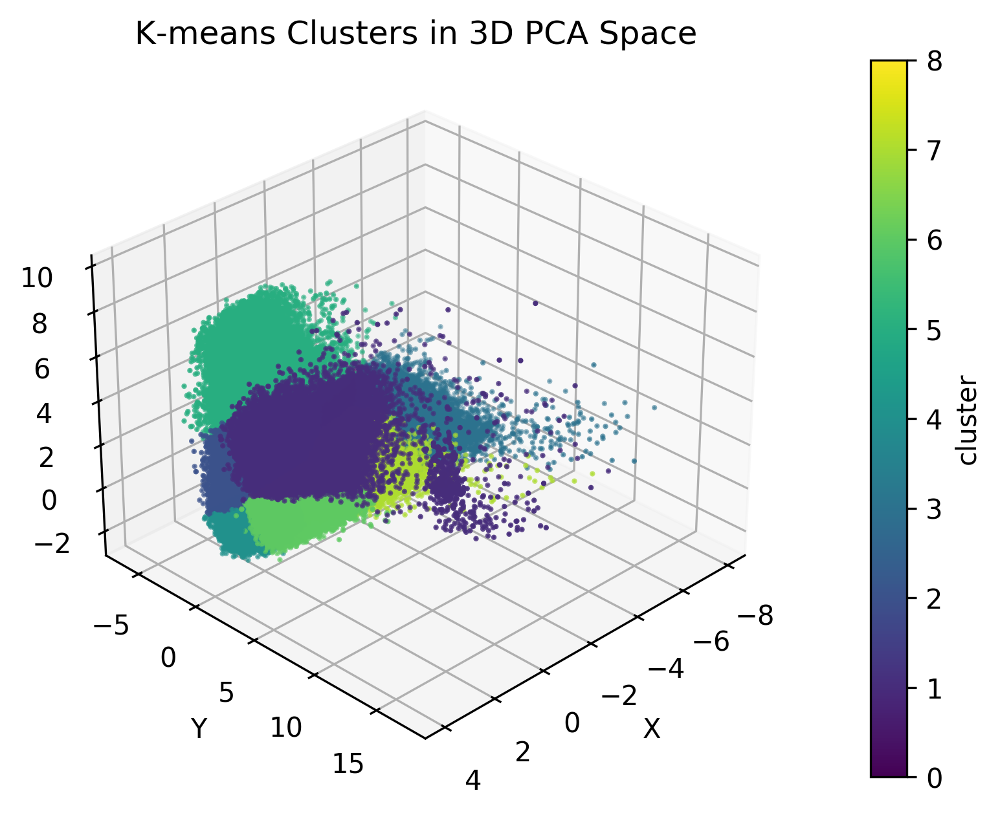
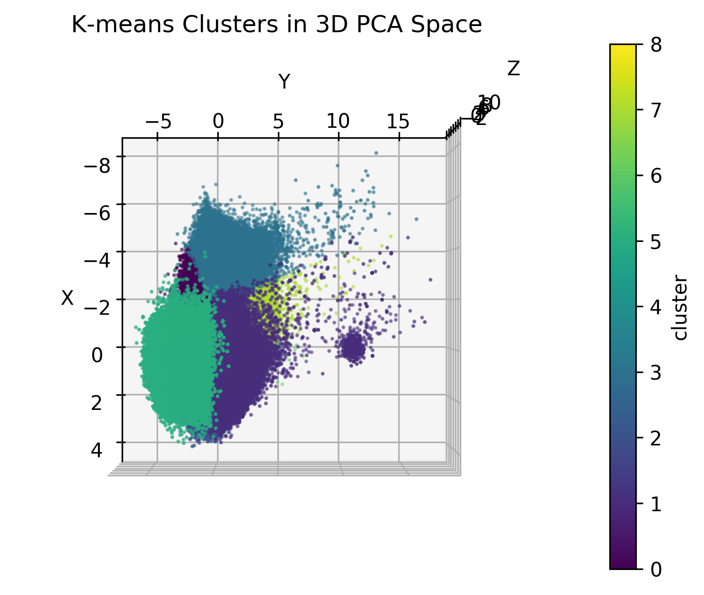
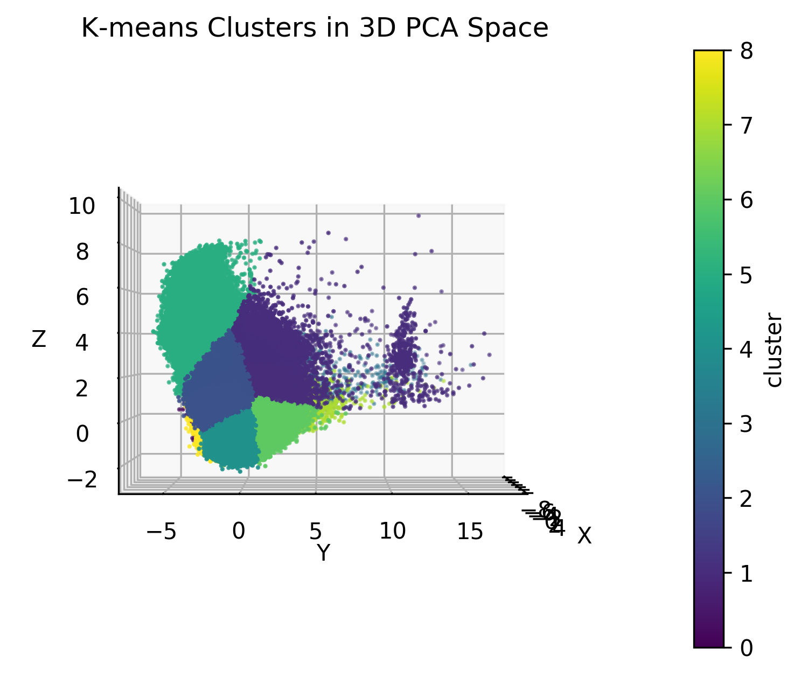
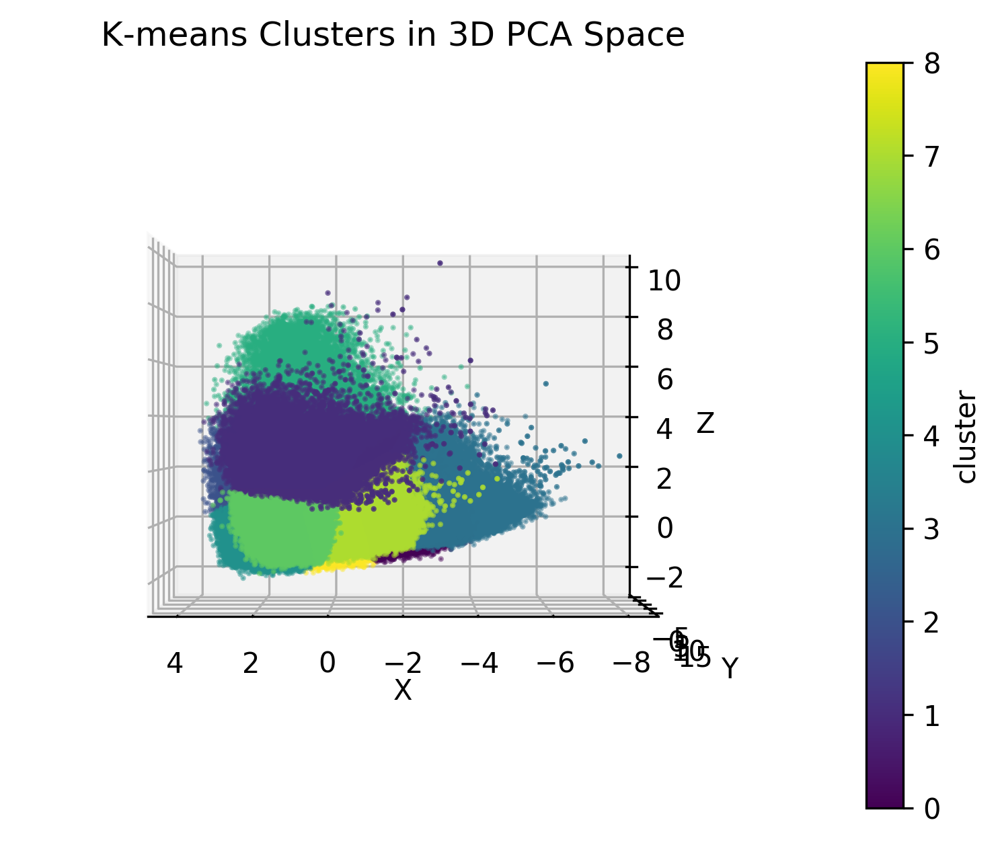

# 1. Build & Execution
First, download the `spotify_pca_cleaned.csv` dataset in `spotify_data/data_links.txt`
Second, download the files for the desired build from the corresponding folder. Make sure everything is in the same directory, then follow the instructons below based on chosen build.
## Serial Build & Execution
```
module load gcc
cd serial\
make
./kmeans_serial ../spotify_pca_cleaned.csv 9 100 ../outputs/serial_output.csv
```
Example usage shown above to replicate our approach with K = 9 and Epochs = 100.

## Shared Memory CPU Build & Execution

```
module load gcc
cd shared\
make
./kmeans_cpu_shared ../spotify_pca_cleaned.csv 9 100 4 ../outputs/cpu_shared_output.csv
```

## Message Passing CPU Build & Execution

(N is however many cores)
```
module load gcc intel-mpi
mpicxx kMeansMpi.cpp -o kMeans
mpiexec -n N kMeans
```

## Message Passing GPU Build & Execution
```
module load gcc cuda intel-mpi cmake
make
mpiexec -n N kMeans
```
Example usage shown above to replicate our approach with K = 9, Epochs = 100 and num_threads = 4.

## Message Parallel CUDA GPU Build & Execution
```
module load cuda
make
./kmeans3d
```
Example usage shown above for K = 9, Epochs = 100, and scaling study for Block sizes 64, 128, 256, 512, and 1024.

# 2. Approaches
Data Cleaning: Due to the high dimensionality of our data, we decided to use the PCA algorithm to compress numeric fields we found relevant to genre (danceability, energy, key, loudness, speechiness, acousticness, instrumentalness, liveness, valence, tempo, and duration_ms). We compressed the N dimensional data into 3 dimensions (x, y, z) and used that for our clustering.

1. Serial: For the serial approach, we used Lloyd's algorithm as described in the given tutorial. For each point, compute the Euclidean squared distance to all centroids or clusters, and assign it to the nearest one. Then recompute each centroid to be the mean of its included points. This is done over n points across m epochs.
2. Parallel Shared Memory CPU: We optimized the serial approach using openMP. To do this, we split the dataset accross the T threads we had available, so each thread was in charge of a subset of points. Each thread maintained their own arrays for each clusters. After a barrier, the individual arrays were combined, and the clusters were updated.
3. Parallel CUDA GPU:
The CUDA implementation of k-means clustering leverages GPU parallelism to efficiently group 3D data points into 9 clusters. This process begins by transferring PCA-reduced Spotify track data to the GPU memory. The algorithm iterates through a series of kernel launches to assign points to the nearest centroids and recompute centroid positions. Assignment is done in parallel with one thread per point, calculating the Euclidean distance to each centroid. Centroid updates are performed using atomic additions to ensure thread safety as multiple threads accumulate sums for shared cluster bins.
4. Distributed Memory CPU: We optimize the serial approach using mpi. To do this we send the centroids to each core, then scatter the dataset accross N cores. Then we calculate the distance for each point. We then gather all the data back to core 0 and recalculate the centroids. 
5. Distributed Memory GPU: We do the same as the Cpu program, but we use cuda to calcuate the distances. 

# 3. Scaling Study Results

## Shared Memory CPU

**Setup:**
- K = 9, max_iters = 100
- Timing via shell 'time' of full end-to-end run

**Results:**
| Threads | Wall‑Clock (s) | Speedup |
|:-------:|:--------------:|:-------:|
| 1       | 4.025          | ----    |
| 2       | 2.997          | 1.34    |
| 3       | 2.550          | 1.58    |
| 4       | 2.498          | 1.61    |
| 5       | 2.486          | 1.62    |

## Parallel CUDA GPU
**Setup:**
- K = 9, max_iters = 100

**Results:**
| Block Size | Runtime (s) | 
|:----------:|:-----------:|
| 64         | 0.2719      |
| 128        | 0.1985      |
| 256        | 0.2006      |
| 512        | 0.2011      |
| 1024       | 0.2058      |

## Distributed CPU
**Setup**
- K = 9, epochs = 100
**Results:**
| Block Size | Runtime (s) | 
|:----------:|:-----------:|
| 1          | 4.5282      |
| 2          | 3.0540      |
| 3          | 2.6019      |
| 4          | 2.4952      |
| 5          | 2.4335      |


## Distributed GPU
**Setup**
- K = 9, epochs = 100, block size = 256
**Results:**
| Block Size | Runtime (s) | 
|:----------:|:-----------:|
| 1          | 3.3547      |
| 2          | 2.1834      |
| 3          | 1.9406      |
| 4          | 1.6277      |
| 5          | 1.6006      |

# 4. Validation
After running 2 or more implementations, validation can be performed using
```python validate.py path-to-directory```
where the .csv files to be checked are stored in the same directory.

# 5. Visualization
  

  

  

  
# 6. Who did what

Kaiden McMillen did the serial and parallel shared memory CPU implementations and their scaling studies. Kaiden also handled the validation and visualization of the implementations. 

Hugh Harps did the distributed CPU and GPU implementations and their scaling studies. 

Wil Stika cleaned the spotify data and took care of the parallel CUDA GPU implementation as well as its scaling study with different block sizes
